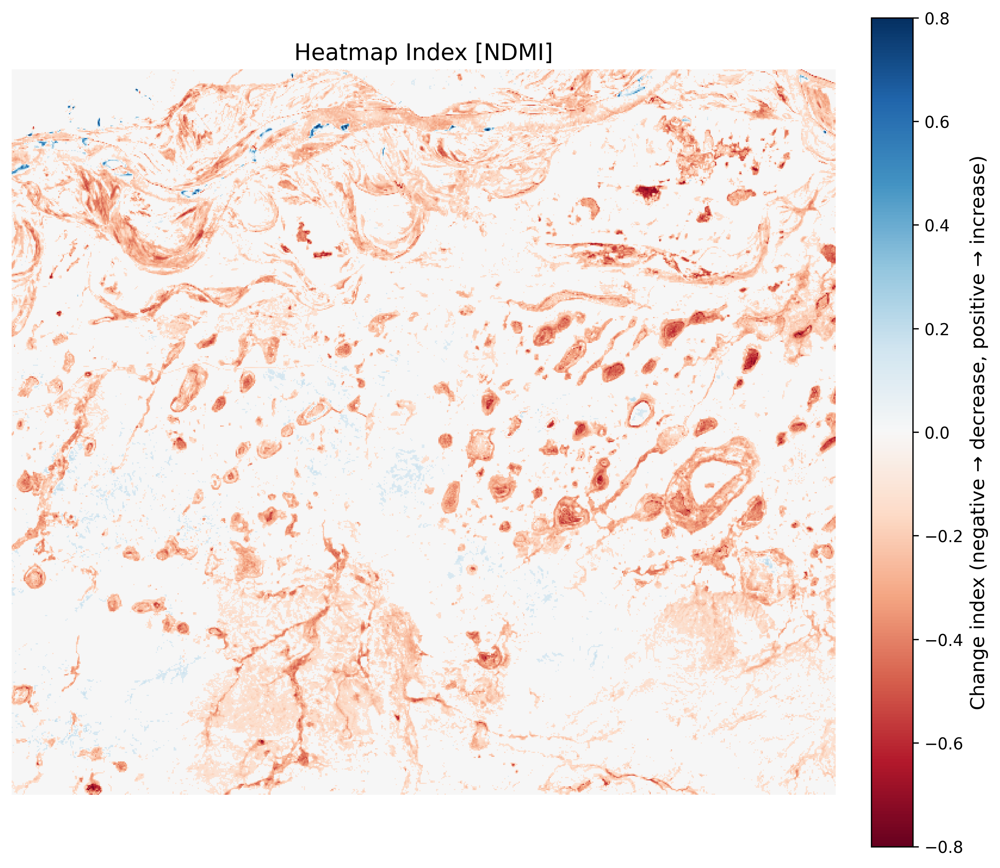

# Satellite Index Analyzer

> Analyze vegetation and moisture conditions anywhere on Earth using real Sentinel-2 satellite imagery — with AI-generated environmental interpretation.

## Key Use Cases

- **Detect Deforestation** — Identify illegal logging and land clearing in protected biomes by detecting rapid drops in canopy density across satellite passes, enabling rapid environmental response.
- **Monitor Crop Health** — Pinpoint vegetation stress zones within agricultural fields to optimize irrigation schedules, reduce water waste, and maximize yield.
- **Track Urban Sprawl** — Visualize the encroachment of urban development on natural landscapes, quantifying green space loss in growing metropolitan areas.
- **Analyze Water Levels** — Monitor seasonal and long-term changes in reservoir and wetland water bodies to track drought impacts and water resource availability.
- **Post-Fire Analysis** — Map wildfire burn intensity and vegetation recovery patterns to guide ecological restoration efforts and assess ecosystem damage.

---





Draw an area on the map → pick a date range → receive a high-resolution index image with pixel-level quality control and an LLM-generated interpretation of the environmental conditions.

---

## Example Outputs

### NDVI — Vegetation Health (Brandenburg, Germany · May 2023)
> Mean NDVI: 0.51 · 61% dense vegetation · 2% missing data

*"The region shows predominantly healthy vegetation consistent with the mixed forest and agricultural landscape typical of central Europe during peak spring growth."*

---

### NDMI — Moisture Index (Gansu Province, China · August 2023)
> Mean NDMI: -0.088 · 99% dry/stressed · Arid landscape confirmed

*"Predominantly negative NDMI values confirm an arid landscape with severely moisture-stressed vegetation, characteristic of the Gobi Desert fringe in late summer."*

---

### Change Detection Heatmap (Yakutia, Russia · 2020 vs 2021)
> 29% area decrease · Mean change: -0.06 · Blue = loss, Red = gain

*"A net decrease in vegetation index suggests significant moisture loss, potentially linked to permafrost thaw cycles or localized logging activity."*

---

## Features

- **Interactive map** — draw your Area of Interest directly on the map
- **NDVI & NDMI indices** — vegetation health and moisture content analysis
- **Change detection** — pixel-level heatmap comparing two time periods
- **Cloud masking** — automatic SCL-based filtering + nearest-neighbour gap filling
- **AI interpretation** — LLaMA 3.3 70B environmental analysis via Groq
- **Quality control** — automated QC pipeline with pass/warn/fail classification
- **Task history** — async processing with real-time status polling
- **JWT auth** — secure login with automatic token refresh

---

## Architecture

```
Browser (React + Vite)
        │
      nginx  ──── static & media files
        │
   Django + DRF                    
   Gunicorn (3 workers)   ──ORM──►   PostgreSQL
        │
      Redis  ◄──── Celery Worker
                      │
               Sentinel Hub API  (satellite imagery)
               Groq API          (AI interpretation)
               NumPy / SciPy     (image processing)
```

---

## Tech Stack

| Layer | Technology |
|---|---|
| Frontend | React 18, Vite, Tailwind CSS, React Leaflet |
| Backend | Django 5, Django REST Framework, SimpleJWT |
| Task queue | Celery 5, Redis 7 |
| Database | PostgreSQL 16 |
| Satellite data | Sentinel Hub API (Sentinel-2 L2A) |
| AI insights | Groq API (LLaMA 3.3 70B) |
| Image processing | NumPy, SciPy, Matplotlib |
| Infrastructure | Docker, Docker Compose, nginx, Gunicorn |

---

## Running Locally

**Requirements:** Docker, [Sentinel Hub](https://www.sentinel-hub.com) account, [Groq](https://console.groq.com) API key.

```bash
git clone https://github.com/mzaorski9/satellite-imagery-app.git
cd satellite-imagery-app
cp .env.example .env   # fill in your credentials
docker compose -f docker-compose.prod.yaml build
docker compose -f docker-compose.prod.yaml up -d
```

Open **http://localhost:80**. See `.env.example` for all required variables.

---

## 📄 License

MIT
